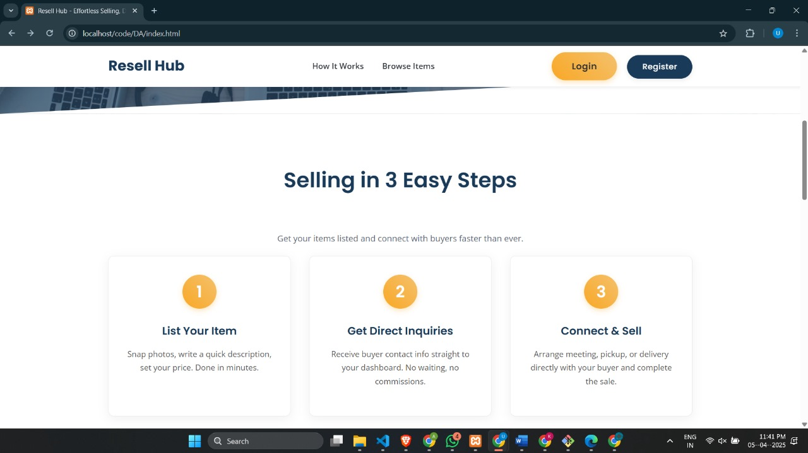

# 22BBS0129 - Achintya Varshneya
# Resell Hub – A Simple Reselling Platform

## 1. Startup Overview
Resell Hub is a startup designed for direct reselling of items between individuals. It provides registered sellers with a straightforward platform to list goods they wish to sell, aiming to simplify the process of reaching potential buyers. The core concept revolves around a direct line of communication; when a buyer expresses interest, their contact details (like email or phone) are passed directly to the seller, helping them to finalize the sale independently and without any platform commissions.

## 2. Concepts Used

### Frontend (Browser)
- **HTML:** Structured all web pages using semantic elements such as headings, forms, lists, tables, images, links, header, main, and footer.
- **CSS:** Styled all pages for a consistent look, managing colors, fonts, and layout. Utilized Flexbox for layout purposes (header, dashboard boxes, sticky footer) and separated styles into global (style.css) and page-specific files (auth_style.css, etc.).
- **JavaScript:** Implemented features like image previews on the listing form using the FileReader API and event handling. Also added confirmation dialogs (using `confirm()`) for delete and status change actions.

### Backend (Server)
- **PHP:** Managed server-side logic including user registration/login, listing creation, status updates, and data retrieval. Processed form submissions (`$_POST`, `$_GET`) and file uploads (`$_FILES`). Generated dynamic HTML content based on database data, managed user login state via sessions, redirected users after actions (using `header()`), logged errors (`error_log`), and handled file saving (`move_uploaded_file`).
- **SQL Connectivity (PHP mysqli):** Connected PHP to the MySQL database (using `db_connect.php`). Employed Prepared Statements (`prepare`, `bind_param`, `execute`) for secure database queries (SELECT, INSERT, UPDATE), fetched data, checked results (`affected_rows`, `insert_id`), and closed connections.
- **Sessions (PHP):** Started sessions (`session_start()`), stored user login info (`$_SESSION['seller_id']`, `$_SESSION['seller_name']`), checked login status on protected pages, and cleared sessions on logout (`session_destroy()`).
- **XML:** Utilized PHP's SimpleXML extension to parse `categories.xml` for dynamically populating the product category dropdown in the listing form. Also used `site_info.xml` to load basic site configurations such as the site name and copyright year.

## 3. Display Images
Below are three images that showcase the interface and key features of Resell Hub:

  
  
  

